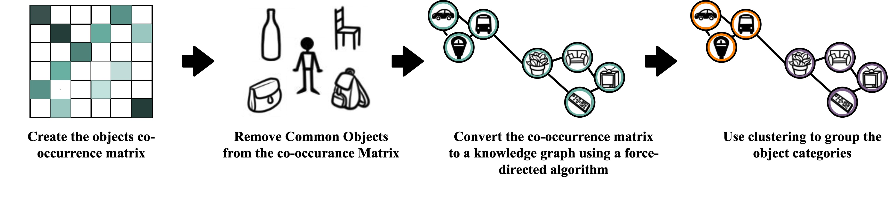
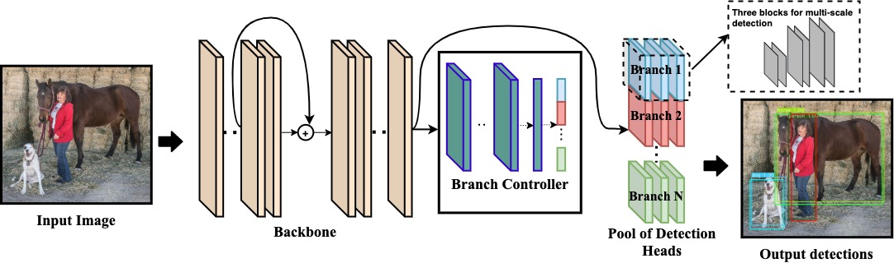

# AdaCon
Adaptive Context-Aware Object Detection for Resource-Constrained Embedded Devices

## Abstract 
Convolutional Neural Networks achieve state-of-the-art accuracy in object detection tasks. However, they have large compute and memory footprints that challenge their deployment on resource-constrained edge devices. In AdaCon, we leverage the prior knowledge about the probabilities that different object categories can occur jointly to increase the efficiency of object detection models. In particular, our technique clusters the object categories based on their spatial co-occurrence probability. We use those clusters to design a hierarchical adaptive network. During runtime, a branch controller chooses which part(s) of the network to execute based on the spatial context of the input frame. 

## How It Works
AdaCon consists of two main steps:
### Spatial-Context based Clustering 


### Adaptive Object Detction model

Our Object Detection model consists of three components: a backbone, a branch controller, and a pool of specialized detection heads (branches).


## Requirements

Python 3.8 or later with all [requirements.txt](https://github.com/ultralytics/yolov3/blob/master/requirements.txt) dependencies installed, including `torch>=1.6`. To install run:
```bash
$ pip install -r requirements.txt
```

## Try it yourself

## Define your model

## Testing
**Test a static YOLO model** 
**Test a dynamic YOLO model**


## Training

**Train a static YOLO model** 
**Train a dynamic YOLO model**


## Citation

This code is a fork from [Ultralytics](https://github.com/ultralytics/yolov3) implementation for [Yolov3](https://pjreddie.com/darknet/yolo/).
