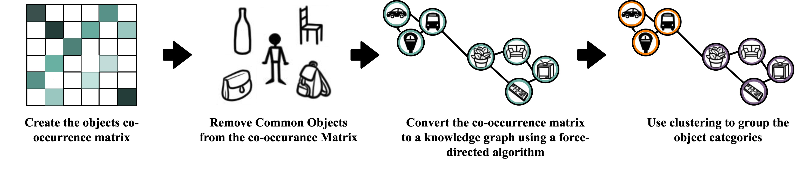
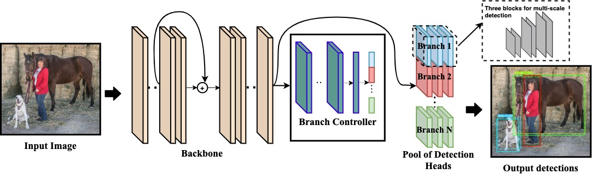

# AdaCon
Adaptive Context-Aware Object Detection for Resource-Constrained Embedded Devices

## Abstract 
Convolutional Neural Networks achieve state-of-the-art accuracy in object detection tasks. However, they have large compute and memory footprints that challenge their deployment on resource-constrained edge devices. In AdaCon, we leverage the prior knowledge about the probabilities that different object categories can occur jointly to increase the efficiency of object detection models. In particular, our technique clusters the object categories based on their spatial co-occurrence probability. We use those clusters to design a hierarchical adaptive network. During runtime, a branch controller chooses which part(s) of the network to execute based on the spatial context of the input frame. 

## Paper
Will be available soon.

## How It Works
AdaCon consists of two main steps:

### Spatial-Context based Clustering 

Spatial-context based Clustering has 5 steps. First, we construct the co-occurrence matrix of the object categories where each value represents the frequency of the co-occurrence of the object categories in the same scene across all the training dataset. Then, we remove the common objects. Next, we convert the frequency-based co-occurrence matrix to a correlation matrix. Then, we use the correlation matrix to build a knowledge graph using Fruchterman-Reingold force-directed algorithm. Finally, we cluster the objects based on their location in the knowledge graph

### Adaptive Object Detction model

Our adaptive object detection model consists of three components: a **backbone**, a **branch controller**, and a **pool of specialized detection heads** (branches). The backbone is first executed to extract the common features in the input image, then a branch controller takes the extracted features and route them towards one or more of the downstream specialized branches. Only the chosen branch(es) are then executed to get the detected object categories and their bounding boxes. During runtime, it has two modes of operation: **single-branch execution mode** where only the branch with the highest confidence score gets executed, and **multi-branch execution mode** where all the branches with a confidence score higher than a certain threshold are executed.

## Requirements

1. Clone the repo `git clone https://github.com/scale-lab/AdaCon.git ; cd AdaCon`

2. Install the requirements with Python 3.8 or later  `pip install -r requirements.txt`

3. Download your dataset. Run `./data/get_coco2014.sh` or `./data/get_coco2017.sh` to download COCO 2014 or COCO 2017 respectively. Or follow this [tutorial](https://github.com/ultralytics/yolov3/wiki/Train-Custom-Data) to use your custom dataset.

## Quick start demo on COCO dataset
1. Define your model. In [model.args](https://github.com/scale-lab/AdaCon/blob/master/model.args), we show an example for defining an adaptive and a static model.

2. Test the adaptive model by running `python test.py --model model.args --data data/coco2014.data --adaptive`. The default is multi-branch execution mode. To run in single-branch execution mode, add `--single` to the test command.

3. Train the model from scratch by running `python train.py --model model.args --data data/coco2014.data --adaptive`

## Try it on your data

1. Cluster your data: run `python cluster.py --data data/coco2014.data --num_clusters 4`
2. Define your model architecture. Example provided in [model.args](https://github.com/scale-lab/AdaCon/blob/master/model.args).

### Training

**Train a static YOLO model** run `python train.py --model model.args --data data/coco2014.data`

**Train a dynamic AdaCon model** run `python train.py --model model.args --data data/coco2014.data --adaptive`

### Testing
**Test a static YOLO model** run `python test.py --model model.args --data data/coco2014.data`

**Test a dynamic AdaCon model** For single branch execution run `python test.py --model model.args --data data/coco2014.data --adaptive --single`, and for multi branch execution run `python test.py --model model.args --data data/coco2014.data --adaptive --multi`

## Citation

This code is a fork from [Ultralytics](https://github.com/ultralytics/yolov3) implementation for [Yolov3](https://pjreddie.com/darknet/yolo/).
